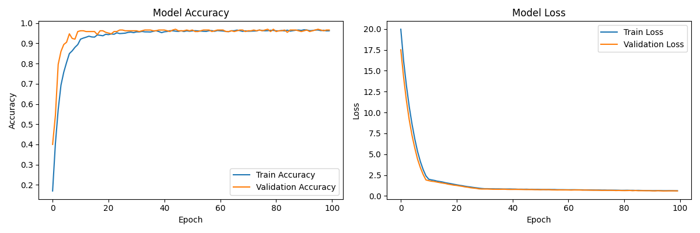

# Irish Snap Detector

## Introduction

This Python project utilises OpenCV to automatically detect snaps in the card game Irish Snap (explanation below). TensorFlow is used to train the model to recognise the cards, ensuring accurate and reliable snap detections.

## Rules of Irish Snap
A game where players take turns placing cards face-up and race to spot pairs or triplets of cards that correspond to the following rules (Note: these rules vary from person to person-these are the rules I usually play with):

1. Basic Snap: consecutive cards with matching values;
2. Top-Bottom Snap: the card played matches the card at the bottom of the pile;
3. Sandwich Snap: the card played matches the one two cards beneath it;
4. Consecutive Cards Snap: cards are in ascending or descending order;
5. Joker Snap: Any joker played;
6. Suit Triplet: three cards of the same suit;
7. Same value as the number called (goes 1-10, J, Q, K don't count);
8. Cards add to 10. 

## Installation
1. Clone the repository
2. Install the dependencies
```pip install -r requirements.txt```

## Dataset

My model was trained using the dataset which can be accessed through [this link](https://www.kaggle.com/datasets/gpiosenka/cards-image-datasetclassification).

My model was trained using EfficientNet V2S, one of the newest and fastest models available. Additionally, it is also pre-trained, allowing for transfer learning. This improves not only the peformance, but the accuracy of the model.

Diagnostics:
Test accuracy: 0.9727
Test loss: 0.5976
Test precision: 0.9722
Test recall: 0.9570
F1 Score: 0.9645

